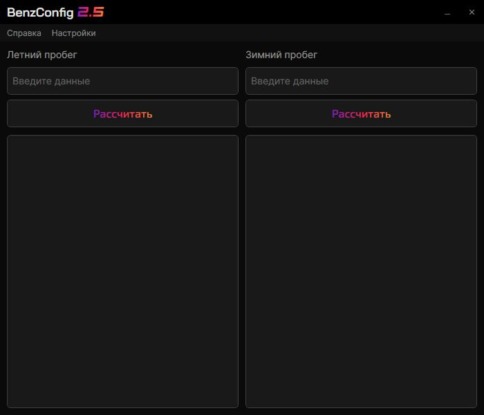

 

## System Requirements | Системные требования

### Russian

Для работы приложения необходима операционная система Windows 10 или 11 (64-bit). Благодаря оптимизации вычислений, программа имеет крайне низкие системные требования.

| Компонент | Минимальные требования | Рекомендуемые требования |
| :--- | :--- | :--- |
| **ОС** | Windows 10 (64-bit) | Windows 10 / 11 (64-bit) |
| **Процессор** | 2-ядерный, от 1.6 ГГц (Intel Core i3 / AMD Ryzen 3) | 4-ядерный, от 2.5 ГГц (Intel Core i5 | AMD Ryzen 5) |
| **Память (RAM)** | 4 ГБ | 4 ГБ или более |
| **Видеокарта** | Встроенная (с поддержкой DirectX 9) | Встроенная (с поддержкой DirectX 12) |
| **Диск** | ~50 МБ *(~150 МБ для автономной версии)* | 200 МБ |

> ⚠️ **Важно:** Если вы запускаете стандартную версию приложения, на вашем компьютере должен быть установлен [** .NET Desktop Runtime 8.0**](https://microsoft.com). Если вы используете автономную версию (Self-contained), дополнительно ничего устанавливать не нужно.

---

### English

The application requires Windows 10 or 11 (64-bit). Due to optimized calculations, the system requirements are extremely low.

| Component | Minimum Requirements | Recommended Requirements |
| :--- | :--- | :--- |
| **OS** | Windows 10 (64-bit) | Windows 10 / 11 (64-bit) |
| **Processor** | Dual-core, 1.5 GHz or faster | Any modern Intel Core / AMD Ryzen |
| **Memory (RAM)**| 4 GB | 4 GB or more |
| **Graphics** | Integrated (DirectX 9 compatible) | Integrated (DirectX 12 compatible) |
| **Storage** | ~50 MB *(~150 MB for Self-contained)*| 200 MB |

> ⚠️ **Note:** Standard build requires [** .NET Desktop Runtime 8.0**](https://microsoft.com) installed on your system. For the Self-contained build, no additional runtime installation is required.
